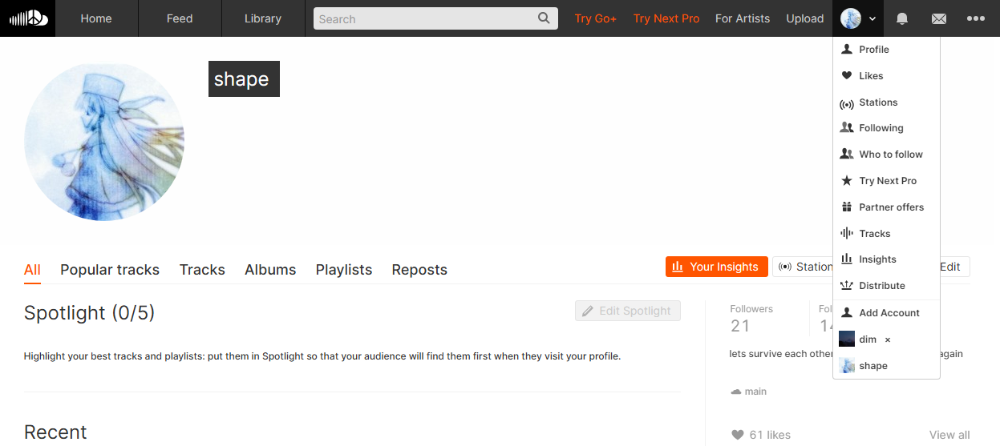

# soundcloud account switcher

**scs** is a browser extension that allows you to switch between multiple SoundCloud accounts.

## Installation

1. Download the repository.
2. Open Google Chrome and enter `chrome://extensions/` in the address bar.
3. Click **Load Unpacked**, go to the repository folder, and select the folder.

## Usage

> Note: The extension has only been tested in Google Chrome. Compatibility with other browsers may come in the future.

If an account is currently logged in, refreshing the page will automatically add the account to the switcher. Click the **Add Account** button and sign in to another account to add it to the list.

To remove an account, hover next to the username in the switcher and click the **x**.

## Debugging

A `scs_cache` exists in local storage for caching account information, such as avatar urls, with oauth cookies stored as `scs_{username}` for each saved account. If there are any issues related to any accounts, you can open inspect element, filter for `scs`, delete the cookies and cache, and add the accounts again.

## Contributing

If you have any suggestions, bug reports, or feature requests, please feel free to open an issue or submit a pull request.

## License

This project is licensed under the [MIT License](LICENSE).
